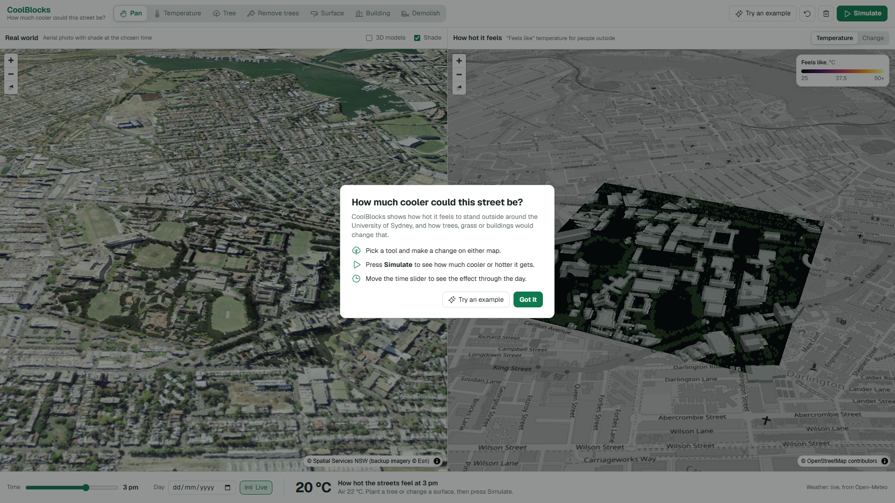
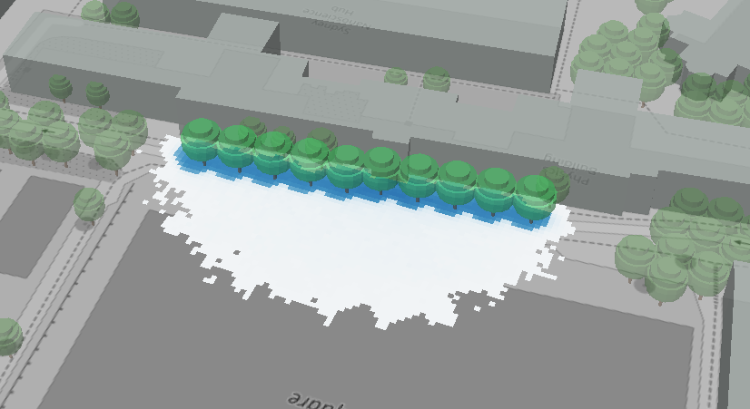
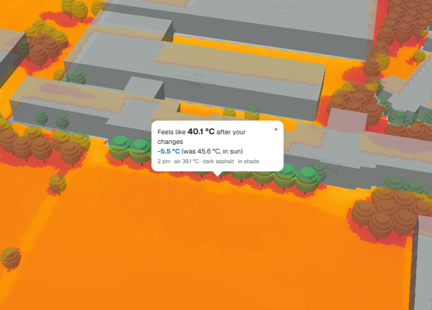
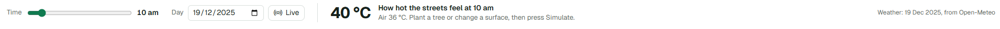
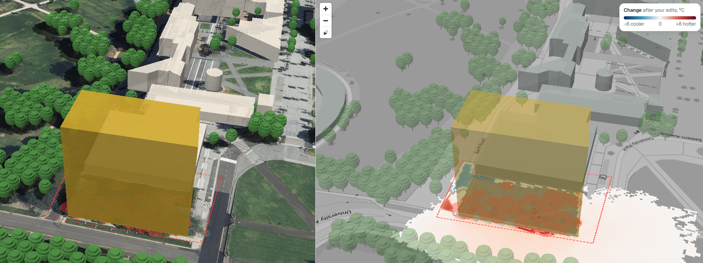
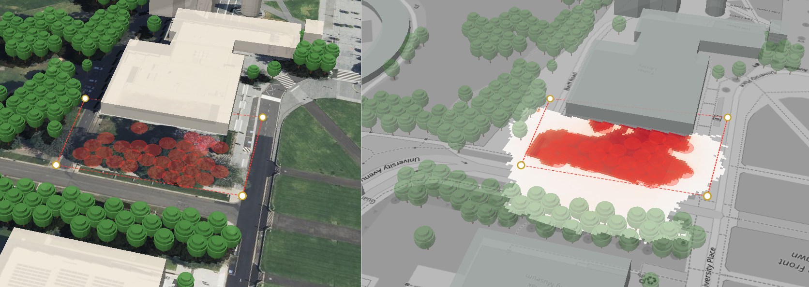
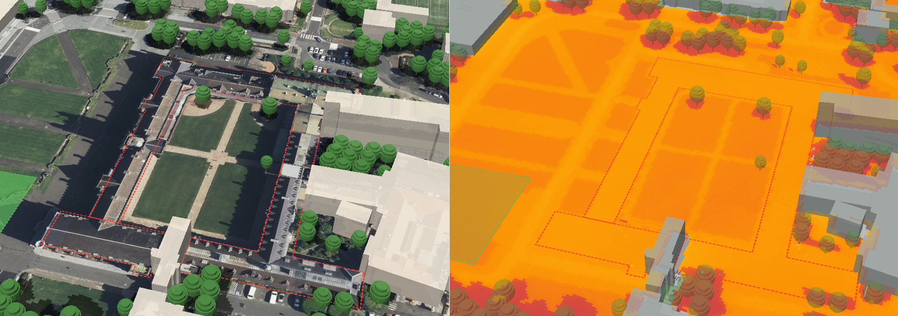
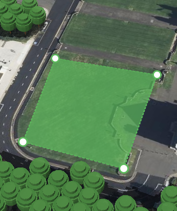
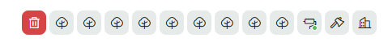

# CoolBlocks

## 🌳 Try it live: [coolblocks.cool](https://coolblocks.cool)

**Plant a tree, change a pavement or reshape a building on a 3D map of the University of Sydney, and see how much cooler (or hotter) the street would feel, hour by hour.**

Built for **Climate Hack-tion 2026** · *Build for 2035* · COP31 priority: **Resilient Cities & Buildings** (helping cities cope with heatwaves).

## The problem
Heatwaves are a major health risk in Australian cities, and heat isn't spread evenly: open asphalt and car parks feel far hotter than shaded, leafy streets. Councils and campus planners have limited budgets for trees and cooler surfaces, and need to see **where** a change helps most **before** they spend.

**Who it's for:** council and campus planners deciding where to plant and what to resurface; community groups making the case for shade.

## What it does
- **Two synced 3D views:** a real-world view (aerial imagery, buildings, trees, shade) and a heat view (the same scene coloured by "feels like" temperature, UTCI).
- **Edit the environment:** plant trees (small/medium/large), remove trees, change ground surfaces (grass, asphalt, reflective "cool" asphalt, paving, soil, water), add, raise or demolish buildings.
- **Simulate:** a physics model recalculates shade and heat for the edited area and shows the before/after change.
- **Time of day:** a slider from 9am to 6pm shows how shade and heat move through the day.
- **Real weather:** live hourly weather for Camperdown, or any past day (e.g. a heatwave).

## Screenshots
 

*Opening view: the real world on the left and "feels like" heat on the right, with a short welcome guide.*
 

*Tools: move the map, check a spot's temperature, plant or remove trees, change the ground, add or knock down buildings.*
 
### Trees cool the street

*"Try an example" plants 10 street trees on a real hot day (19 Dec 2025). Blue shows where it now feels cooler.*
 

*Click any spot to compare: under the new trees it feels 5.5 °C cooler (45.6 °C down to 40.1 °C).*
 

*Choose the day and move through the hours from 9 am to 6 pm.*
 
### Change the city

*Add a building: it casts new shade, but the trees it replaces make the area around it hotter (red).*
 

*Remove trees: losing shade makes that spot feel hotter.*
 

*Demolish a building and see how the heat changes where it stood.*
 
 
 
*Left: draw any shape by clicking its corners, and drag the circles to resize it. Right: every change you make is listed, and clicking one deletes it.*

## How it works
```
frontend (MapLibre, two synced 3D maps) ──POST /api/simulate──►  backend (FastAPI)
                                                                   1. cut a patch around the edits (+ buffer)
                                                                   2. edit copies of the height / tree / surface maps
                                                                   3. run SOLWEIG before + after, per hour
◄──────────── per-hour stats + heat / change / shade images ────   4. difference, stats, PNG overlays
```
- **Heat engine:** [SOLWEIG](https://github.com/UMEP-dev/solweig) (UMEP), which models sun, shade, sky view and radiation to compute mean radiant temperature and UTCI at 1 m resolution. Run with `conifer=True` so trees stay in leaf in the Southern Hemisphere summer.
- **Accuracy:** sun position and shadows were checked against an independent solar formula for Sydney. SOLWEIG is field-validated in Gothenburg (Tmrt error ~3–7 °C), so we present **changes** (before vs after) rather than exact temperatures.

## Run it locally
```bash
cd backend
python -m venv .venv && source .venv/bin/activate      # Python 3.11–3.13
pip install -r requirements.txt
uvicorn server:app --reload
# open http://127.0.0.1:8000  (app)   or   http://127.0.0.1:8000/docs  (API)
```
The real USYD area data is in the repo (`backend/data/`), so it works straight after cloning. On the first start the
server builds the tree-height map from the canopy file (a second or two). Without area data it falls back to a
**synthetic demo block**.

### Rebuild the USYD area (only needed to change the area)
```bash
cd backend
python scripts/clip_canopy.py path/to/gsr_2024_canopy_gda2020.zip   # -> data/raw/canopy_usyd.tif
python scripts/build_area.py --canopy data/raw/canopy_usyd.tif --osm-json data/raw/osm.json
# --dem defaults to the Copernicus GLO-30 tile online; use --bbox W S E N for another area
```
This uses OpenStreetMap buildings, roads, parks and water (cached in `osm.json`) and writes 1 m maps (EPSG:7856) to
`data/area/`. Restart the server to use them.

## API
| Endpoint | What |
|---|---|
| `GET /api/area` | bounds, tree sizes, surface types, hours |
| `GET /api/buildings`, `GET /api/trees` | GeoJSON for the 3D views |
| `GET /api/weather?date=` | hourly weather (live if no date) |
| `GET /api/baseline?date=` | heat + shade images for the whole area (cached after the first call) |
| `POST /api/simulate` | `{edits, date?, hours?}` → per-hour stats and heat / change / shade images |
| `GET /api/point?lon=&lat=&hour=&date=&sim_id=` | "feels like" temperature at one spot, before and after edits |

Edit types: `add_tree` (Point, `size`), `remove_trees` (Polygon), `surface` (Polygon, `surface`), `building` (Polygon, `height` in m; `0` = demolish).

## Data sources
| Data | Source | Licence |
|---|---|---|
| Buildings, roads, parks, water | OpenStreetMap (Overpass API) | ODbL, © OpenStreetMap contributors |
| Tree canopy | NSW Planning, Greater Sydney Region Tree Canopy 2024/25 | CC BY-NC-ND 4.0 (unchanged USYD cut-out included; derived tree heights are built locally, not shared) |
| Ground elevation | Copernicus GLO-30 DEM | Copernicus licence |
| Weather (live / past days) | Open-Meteo | CC BY 4.0 |
| Hot-day selection, air temperature | Western Sydney University, City of Sydney sensor network 2023/24 | CC BY 4.0 |
| Weather (specific days) | ERA5 (Copernicus CDS), PVGIS TMY | Copernicus licence |
| Aerial imagery basemap | NSW Spatial Services | CC BY 4.0 |
| Map basemap | OpenStreetMap tiles | ODbL |

The code is GPL-3.0; the data files keep their own licences. See [`backend/data/LICENSES.md`](backend/data/LICENSES.md).

## Limitations
- Results are model estimates; show changes, not absolute readings.
- Tree heights use a standard height per canopy area (no per-tree heights yet); LiDAR from NSW ELVIS is the upgrade path.
- Building heights come from OSM tags where available, otherwise estimated from levels or a default.
- Reflective "cool" pavement can make it feel **hotter** for people in the sun (reflected sunlight); trees and grass are the clear wins.
- SOLWEIG doesn't model indoor energy use.

## Tools & AI disclosure
Python, FastAPI, SOLWEIG, rasterio, pyproj, shapely, matplotlib, MapLibre GL JS. **Claude (Anthropic)** was used for planning, data checks and generating starter code (backend, data script, frontend), which the team then extended. *(Team: add any other tools you use.)*

## Licence
GPL-3.0 (required because SOLWEIG is GPL-3.0). Data stays under its original licences above.
